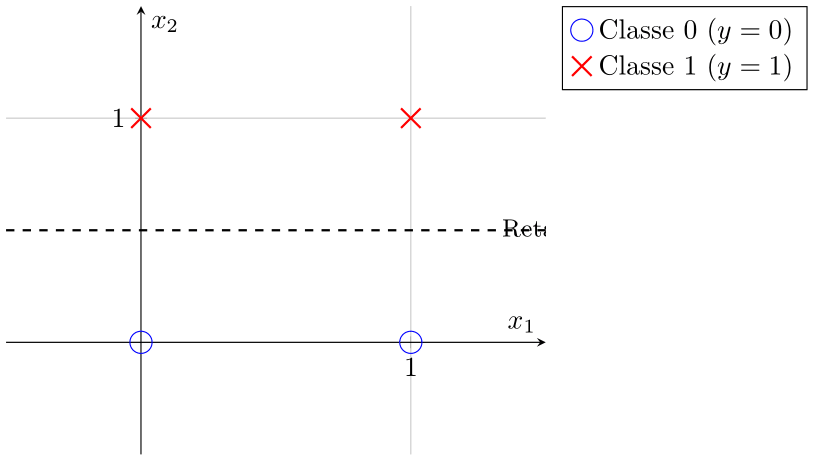
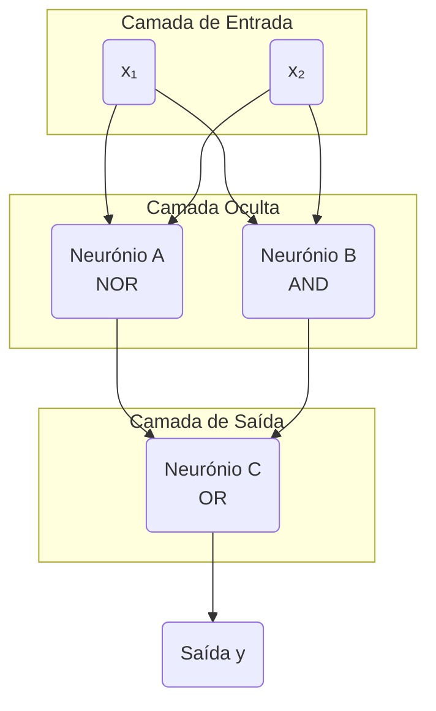
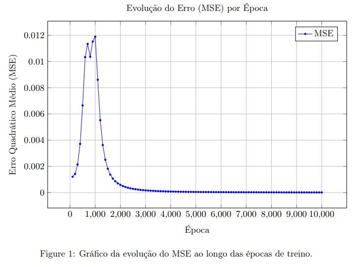

# Problem 3: Perceptrons

**Autor:** Brandon Mejia

Este projeto implementa uma Rede Neuronal Multicamada (MLP) em Java. O código demonstra a construção, configuração manual, treino e teste de redes neuronais para resolver tanto funções lógicas linearmente separáveis quanto não separáveis.

## Estrutura do Projeto

O projeto está organizado nas seguintes classes e pacotes principais:
-   `neural/MLP.java`: A classe principal que implementa a Rede Neuronal Multicamada (MLP), capaz de ser configurada, treinada e usada para previsões.
-   `neural/activation/`: Pacote contendo as funções de ativação (ex: `Sigmoid`, `Step`) e a sua interface `IDifferentiableFunction`.
-   `apps/MLPNXOR.java` (com modo `singleNeuron`): Aplicação de exemplo que demonstra tanto a configuração manual de um único neurónio (para a função `y = x2`) quanto o treino de uma MLP para o problema XNOR.
-   `apps/MLPNXOR.java`: Aplicação de exemplo que treina uma MLP para resolver o problema não linearmente separável da porta XNOR.

## Como Executar

1.  **Compilar o código:**
    A partir do diretório raiz do projeto, compile todos os arquivos `.java`.
    ```bash
    javac src/math/*.java src/neural/*.java src/neural/activation/*.java src/apps/*.java
    ```

2.  **Executar a aplicação:**
    Para testar o neurónio único (Tarefa 3):
    ```bash 
    java -cp src apps.MLPNXOR 
    ```
    Para treinar e testar a MLP para XNOR (Tarefa 4):
    ```bash
    java -cp src apps.MLPNXOR
    ```

---

## Tarefa 1: Propor um conjunto de dados

A tarefa pede um conjunto de dados com 4 exemplos que seja **linearmente separável**. Propomos a função lógica **$y = x_2$**.

A tabela de verdade para esta função é:

| $x_1$ | $x_2$ | $y$ (Saída) |
| :---: | :---: | :---------: |
|   0   |   0   |    **0**    |
|   0   |   1   |    **1**    |
|   1   |   0   |    **0**    |
|   1   |   1   |    **1**    |

Este problema é **linearmente separável**, pois uma única reta (ex: $x_2 = 0.5$) pode separar as duas classes.



---

## Tarefa 2: Calcular pesos para um único neurónio

A tarefa pede para calcular, sem treino, os pesos de um **único neurónio** que resolva o conjunto de dados da Tarefa 1 com erro zero.

Usaremos a **Função Degrau (Step Function)** como função de ativação:

$$
\text{Saída} = \begin{cases}
1 & \text{se } z \ge 0 \\
0 & \text{se } z < 0
\end{cases}
$$

A soma ponderada (input líquido) é $z = w_0 + w_1x_1 + w_2x_2$. Para resolver $y = x_2$, uma solução de pesos é:

**Pesos do Neurónio Único:** $w_0 = -1$, $w_1 = 0$, $w_2 = 1$.

---

## Tarefa 3: Implementar e testar o neurónio

Testamos o neurónio único configurado na Tarefa 2. A tabela abaixo valida o seu funcionamento.

| Entrada ($x_1, x_2$) | Cálculo ($z = -1 + 0 \cdot x_1 + 1 \cdot x_2$) | Saída $y$ | Esperada |
| :------------------: | :-------------------------------------------: | :-------: | :------: |
|         0, 0         |              $z = -1 + 0 + 0 = -1$              |   **0**   |  **0**   |
|         0, 1         |               $z = -1 + 0 + 1 = 0$              |   **1**   |  **1**   |
|         1, 0         |              $z = -1 + 0 + 0 = -1$              |   **0**   |  **0**   |
|         1, 1         |               $z = -1 + 0 + 1 = 0$              |   **1**   |  **1**   |

---
### Implementação em Java

A implementação em Java que testa este neurónio único está no método `singleNeuron()` da classe `apps.MLPNXOR`. O código configura uma MLP com uma topologia `[2, 1]` para atuar como um único neurónio, aplica os pesos calculados manualmente e valida o resultado.

---

## Tarefa 4: Configurar a Rede Multicamada (MLP) para a função XNOR

Para demonstrar a capacidade de uma rede mais complexa, configuramos uma MLP para resolver a função **XNOR (NOT XOR)**. Este é um problema clássico **não linearmente separável**, que um único neurónio não consegue resolver.

### Lógica (Álgebra Booleana)

A tabela de verdade para a função XNOR é:

| $x_1$ | $x_2$ | $y$ (Saída) |
| :---: | :---: | :---------: |
|   0   |   0   |    **1**    |
|   0   |   1   |    **0**    |
|   1   |   0   |    **0**    |
|   1   |   1   |    **1**    |

Para resolver este problema, decompomos a lógica em funções linearmente separáveis:

$$
y = (\neg x_1 \cdot \neg x_2) + (x_1 \cdot x_2)
$$

-   O **Neurónio A** implementará a porta **NOR** ($\neg x_1 \cdot \neg x_2$).
-   O **Neurónio B** implementará a porta **AND** ($x_1 \cdot x_2$).
-   O **Neurónio C** combinará as saídas com uma porta **OR** ($A + B$).

### Diagrama da Rede Neuronal

O diagrama abaixo ilustra a arquitetura da rede, onde os neurônios A e B formam a camada oculta e o neurônio C é a camada de saída.



### Resolução (Configurar os Pesos da MLP)

Configuramos os pesos de cada neurónio para executar a sua parte da lógica, usando a Função Degrau.

#### Neurónio A = $\neg x_1 \cdot \neg x_2$ (NOR)
-   **Pesos:** $w_0 = 0.5$, $w_1 = -1$, $w_2 = -1$

#### Neurónio B = $x_1 \cdot x_2$ (AND)
-   **Pesos:** $w_0 = -1.5$, $w_1 = 1$, $w_2 = 1$

#### Neurónio C = $A + B$ (A OR B)
-   **Pesos:** $w_0 = -0.5$, $w_A = 1$, $w_B = 1$

### Verificação Final da Rede Completa

A implementação em Java da rede MLP foi testada e funciona perfeitamente para a função XNOR, conforme a tabela abaixo.

| Entrada ($x_1, x_2$) | Neurónio A ($a$) | Neurónio B ($b$) | Neurónio C ($y$) | Saída Final | Esperada |
| :------------------: | :--------------: | :--------------: | :--------------: | :---------: | :------: |
|         0, 0         |      **1**       |      **0**       |      **1**       |    **1**    |  **1**   |
|         0, 1         |      **0**       |      **0**       |      **0**       |    **0**    |  **0**   |
|         1, 0         |      **0**       |      **0**       |      **0**       |    **0**    |  **0**   |
|         1, 1         |      **0**       |      **1**       |      **1**       |    **1**    |  **1**   |

---

## Tarefa 5: Treino com Backpropagation (XNOR)

Esta secção analisa os resultados do treino da rede para a função XNOR, utilizando o algoritmo de *backpropagation*. Comparamos os pesos calculados manualmente com os pesos obtidos após o treino.

### Comparação dos Pesos (Manuais vs. Treinados)

**Pesos Manuais (Baseados em Lógica):**

| Camada Oculta | Neurónio A (NOR) | Neurónio B (AND) |
| :------------ | :--------------: | :--------------: |
| $w_0$ (Bias)  |       0.5        |       -1.5       |
| $w_1$ (de $x_1$) |       -1         |        1         |
| $w_2$ (de $x_2$) |       -1         |        1         |

| Camada de Saída | Neurónio C (OR) |
| :-------------- | :-------------: |
| $w_0$ (Bias)    |      -0.5       |
| $w_A$ (de A)    |        1        |
| $w_B$ (de B)    |        1        |

**Pesos Treinados (Resultado do Backpropagation):**

Os pesos abaixo são um exemplo obtido após treinar a rede com uma semente aleatória específica.

| Camada Oculta | Neurónio A (H0) | Neurónio B (H1) |
| :------------ | :-------------: | :-------------: |
| $w_0$ (Bias)  |     -2.9534     |     -2.2084     |
| $w_1$ (de $x_1$) |      3.7568     |      4.6566     |
| $w_2$ (de $x_2$) |      5.2512     |      4.6123     |

| Camada de Saída | Neurónio C (Out0) |
| :-------------- | :---------------: |
| $w_0$ (Bias)    |       1.8347      |
| $w_A$ (de H0)   |       0.6166      |
| $w_B$ (de H1)   |       0.5152      |

**Análise:** Os pesos obtidos pelo treino são muito diferentes dos calculados manualmente. Isto ocorre porque:
1.  **Não há solução única:** Existem infinitas combinações de pesos que podem resolver o problema XNOR.
2.  **Inicialização Aleatória:** O algoritmo de backpropagation parte de pesos aleatórios e converge para uma solução local, que depende desse ponto de partida.
3.  **Lógica vs. Otimização Matemática:** A solução manual foi baseada em lógica humana (portas NOR, AND, OR). A solução do treino é puramente matemática, focada em minimizar o erro (MSE). Os neurónios da camada oculta na rede treinada provavelmente não representam funções lógicas "limpas", mas sim uma combinação matemática que, em conjunto, resolve o problema.

### Evolução do Erro de Treino (MSE)

O gráfico demonstra a evolução do Erro Quadrático Médio (MSE) ao longo de 10.000 épocas de treino. Observa-se que o erro diminui drasticamente nas primeiras épocas e converge para um valor muito próximo de zero, indicando que a rede aprendeu a mapear as entradas para as saídas desejadas com sucesso.



