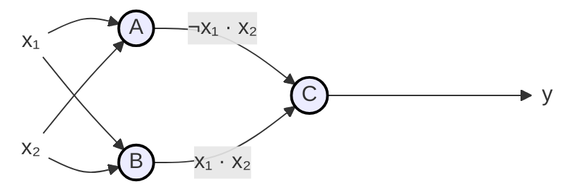

# Problem 3: Perceptrons

**Autor:** IA 2025/26

Este projeto implementa um Perceptron e uma Rede Neuronal Multicamada (MLP) em Java, baseando-se na resolução de um problema de classificação linearmente separável. O código demonstra a construção, configuração e teste de redes neuronais para resolver funções lógicas.

## Estrutura do Projeto

O projeto está organizado nas seguintes classes Java:

-   `Neuron.java`: Representa um único neurónio. Encapsula os pesos, o bias e a função de ativação.
-   `NeuralNetwork.java`: Representa uma rede neuronal feed-forward. Orquestra as camadas de neurónios e gere o fluxo de dados.
-   `Main.java`: O ponto de entrada da aplicação. Configura a rede para resolver um problema específico, executa os testes e imprime os resultados.

## Como Executar

1.  **Compilar o código:**
    Navegue até ao diretório `src` e execute o compilador Java.
    ```bash
    javac src/*.java
    ```

2.  **Executar a aplicação:**
    A partir do diretório pai de `src`, execute a classe `Main`.
    ```bash
    java src.Main
    ```

---

## Tarefa 1: Propor um conjunto de dados

A tarefa pede um conjunto de dados com 4 exemplos que seja **linearmente separável**. Propomos a função lógica **$y = x_2$**.

A tabela de verdade para esta função é:

| $x_1$ | $x_2$ | $y$ (Saída) |
| :---: | :---: | :---------: |
|   0   |   0   |    **0**    |
|   0   |   1   |    **1**    |
|   1   |   0   |    **0**    |
|   1   |   1   |    **1**    |

Este problema é **linearmente separável**, pois uma única reta (ex: $x_2 = 0.5$) pode separar as duas classes.


---

## Tarefa 2: Calcular pesos para um único neurónio

A tarefa pede para calcular, sem treino, os pesos de um **único neurónio** que resolva o conjunto de dados da Tarefa 1 com erro zero.

Usaremos a **Função Degrau (Step Function)** como função de ativação:

$$
\text{Saída} = \begin{cases}
1 & \text{se } z \ge 0 \\
0 & \text{se } z < 0
\end{cases}
$$

A soma ponderada (input líquido) é $z = w_0 + w_1x_1 + w_2x_2$. Para resolver $y = x_2$, uma solução de pesos é:

**Pesos do Neurónio Único:** $w_0 = -1$, $w_1 = 0$, $w_2 = 1$.

---

## Tarefa 3: Implementar e testar o neurónio

Testamos o neurónio único configurado na Tarefa 2. A implementação em Java confirma que ele funciona perfeitamente para o problema.

| Entrada ($x_1, x_2$) | Cálculo ($z = -1 + 0 \cdot x_1 + 1 \cdot x_2$) | Saída $y$ | Esperada |
| :------------------: | :-------------------------------------------: | :-------: | :------: |
|         0, 0         |              $z = -1 + 0 + 0 = -1$              |   **0**   |  **0**   |
|         0, 1         |               $z = -1 + 0 + 1 = 0$              |   **1**   |  **1**   |
|         1, 0         |              $z = -1 + 0 + 0 = -1$              |   **0**   |  **0**   |
|         1, 1         |               $z = -1 + 0 + 1 = 0$              |   **1**   |  **1**   |

---

## Tarefa 4: Configurar a Rede Multicamada (MLP)

Para demonstrar uma rede mais complexa, o problema é resolvido com uma estrutura MLP, decompondo a lógica.

### Lógica (Álgebra Booleana)

A função lógica implementada é equivalente a $y=x_2$:

$$
y = (\neg x_1 \cdot x_2) + (x_1 \cdot x_2)
$$

### Diagrama da Rede Neuronal

O diagrama abaixo ilustra a arquitetura da rede, onde os neurônios A e B formam a camada oculta e o neurônio C é a camada de saída.



### Resolução (Configurar os Pesos da MLP)

Configuramos os pesos de cada neurónio para executar a sua parte da lógica.

#### Neurónio A = $\neg x_1 \cdot x_2$
-   **Pesos:** $w_0 = -1$, $w_1 = -2$, $w_2 = 2$

#### Neurónio B = $x_1 \cdot x_2$
-   **Pesos:** $w_0 = -2$, $w_1 = 1$, $w_2 = 1$

#### Neurónio C = $A + B$ (A OR B)
-   **Pesos:** $w_0 = -1$, $w_A = 1$, $w_B = 1$

### Verificação Final da Rede Completa

A implementação em Java da rede MLP foi testada e funciona perfeitamente, conforme a tabela abaixo.

| Entrada ($x_1, x_2$) | Neurónio A ($a$) | Neurónio B ($b$) | Neurónio C ($y$) | Saída Final | Esperada |
| :------------------: | :--------------: | :--------------: | :--------------: | :---------: | :------: |
|         0, 0         |      **0**       |      **0**       |      **0**       |    **0**    |  **0**   |
|         0, 1         |      **1**       |      **0**       |      **1**       |    **1**    |  **1**   |
|         1, 0         |      **0**       |      **0**       |      **0**       |    **0**    |  **0**   |
|         1, 1         |      **0**       |      **1**       |      **1**       |    **1**    |  **1**   |
