# Problem 4: 2 or 3? - Classificação Binária com MLP

**Autor:** Brandon Mejia

**Data:** Dezembro 2025

---

## 📝 Descrição do Problema e Algoritmo

O objetivo deste laboratório é desenvolver um classificador binário capaz de distinguir entre os dígitos manuscritos **'2'** e **'3'**. O problema utiliza um subconjunto simplificado do dataset MNIST.

* **Dataset:** O ficheiro fornecido (`dataset.csv`) contém **800 exemplos** (imagens).
* **Dimensões:** Cada imagem possui $20 \times 20$ pixeis, resultando em 400 valores de entrada por exemplo.
* **Modelo:** A solução baseia-se numa rede *Multi-Layer Perceptron* (MLP), reaproveitando a implementação do Problema 3, adaptada para classificação binária com o algoritmo de *Backpropagation*.

---

## 📊 Análise Exploratória de Dados

Para compreender a complexidade intrínseca do problema, realizámos uma análise estatística e visual dos dados.

### Separabilidade Linear (PCA)
Projetámos os dados num espaço 2D usando a Análise de Componentes Principais (PCA).

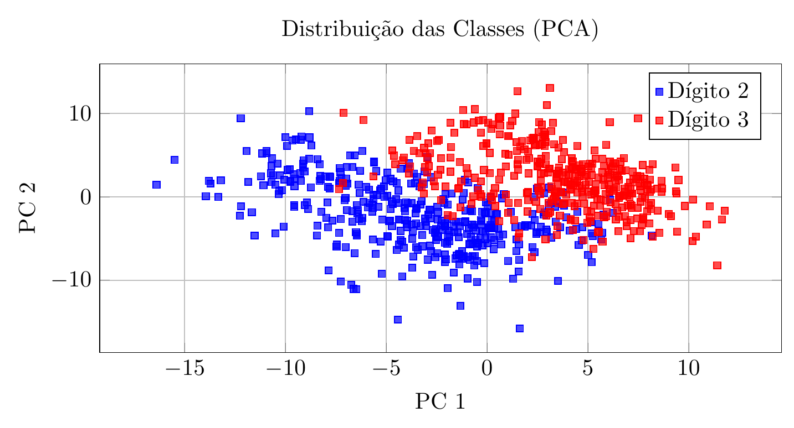

> **Observação:** A visualização PCA mostra que, embora existam agrupamentos, as classes não são linearmente separáveis na fronteira. Isto sugere que precisamos de $N$ neurónios na camada oculta, situando-se no intervalo $2 \le N \le 6$.

### Topologia e Mapa de Diferença
Calculámos a imagem média de cada classe e a diferença absoluta entre elas.

| Média '2' | Heatmap Diferença | Média '3' |
| :---: | :---: | :---: |
| 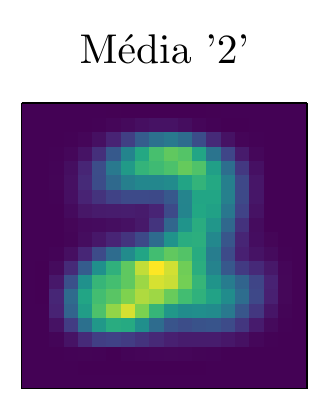 | 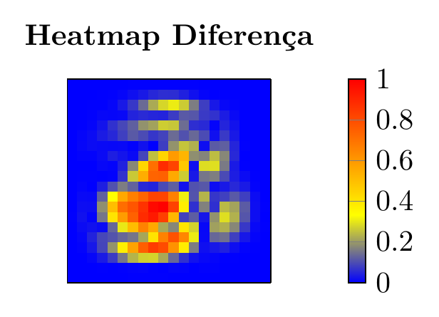 | 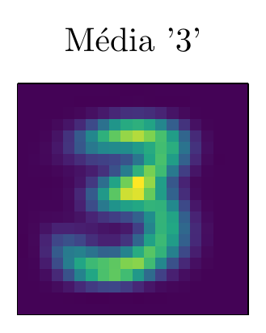 |

> O mapa de calor (centro) revela as zonas de maior variância entre as médias das duas classes. A complexidade desta topologia dita a necessidade de neurónios na camada oculta.

---

## 🧠 Arquitetura da Rede

A definição da arquitetura não seguiu uma abordagem estática. Compreendemos que a topologia da rede está intrinsecamente ligada à natureza dos dados de treino:

* **Dados ruidosos:** Exigem uma camada oculta mais vasta para capturar as nuances.
* **Dados limpos:** Permitem o uso de menos neurónios, favorecendo a generalização.

Desta forma, a nossa arquitetura base define-se por:

* **Camada de Entrada:** 400 neurónios (Imagem $20 \times 20$).
* **Camada Oculta:** Variável ($N$ neurónios), onde o intervalo experimental testado foi entre **6 e 2 neurónios**.
* **Camada de Saída:** 1 neurónio (Ativação Sigmoide).

---

## 🛠 Opções de Design e Metodologia

### A Classe `HyperparameterTuner`
Para resolver a dependência entre a complexidade dos dados e a arquitetura, desenvolvemos a classe **`HyperparameterTuner`**. Esta ferramenta automatiza a experimentação, testando iterativamente diferentes topologias e hiperparâmetros (Learning Rate, Momentum).

### Funcionalidades Avançadas (MLP)
A implementação inclui melhorias essenciais:
1.  **Normalização:** Inputs estritamente normalizados para o intervalo $[0, 1]$.
2.  **Decodificação da Saída:** Definimos um limiar (*threshold*) de 0.5.
    * Valor $< 0.5$: Classificado como **2**.
    * Valor $\ge 0.5$: Classificado como **3**.
3.  **Momentum e Regularização L2:** Utilizados para acelerar a convergência.

### Estratégia de Treino
* **Paragem:** Utilizámos *Early Stopping* com validação cruzada (80/20).
* **Estabilidade (Batch Size):** Definimos o *batch size* em **32**. Esta escolha revelou-se fundamental para estabilizar a aprendizagem e reduzir a oscilação do erro (MSE), evitando saltos abruptos nos pesos.

### Scripts Auxiliares
Os scripts utilizados para pré-processamento e validação foram:
* `analisador_dados.py`: Pré-processamento e visualização.
* `testar_dados.py`: Testes e validação.

O código fonte completo e as ferramentas utilizadas podem ser consultados no repositório:

[**🔗 Repositório GitHub - Ferramentas e Scripts**](https://github.com/kanekitakitos/Inteligencia_Artificial/tree/main/04%20-%20MLP%20identify%203%20and%202/tools-for-data)

---

## 📈 Resultados e Discussão

Os resultados demonstraram o comportamento da rede face à complexidade:
* **Redes maiores (5-6 neurónios):** Convergência rápida, mas maior oscilação no teste.
* **Redes menores (2-3 neurónios):** Curva de aprendizagem mais suave e generalização superior.
* **Acurácia Final:** O modelo selecionado atinge consistentemente resultados no intervalo **99% - 100%**.

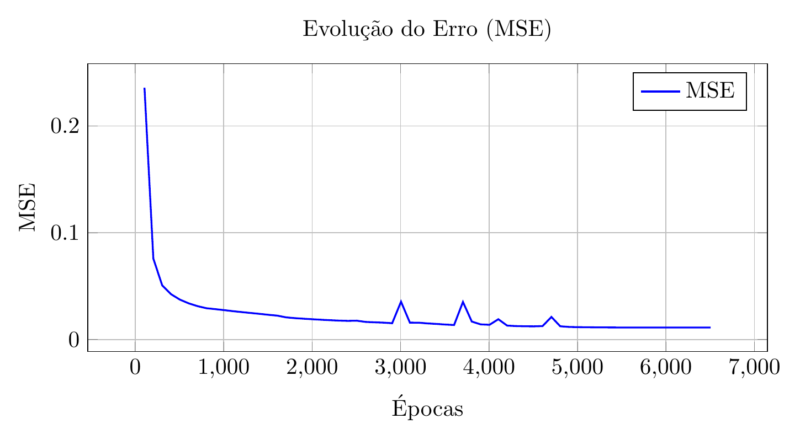
*Curva de aprendizagem baseada nos dados experimentais recolhidos.*

---

## 👁️ Visualização do Pré-processamento

O foco desta experimentação foi avaliar a robustez da rede manipulando a variância dos dados (introduzindo ruído, rotações e cortes).

| | | | |
|:---:|:---:|:---:|:---:|
| 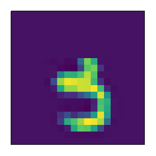 Corte 7 bits (cima) | 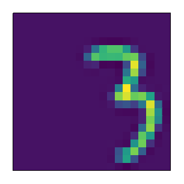 Translação +5 | 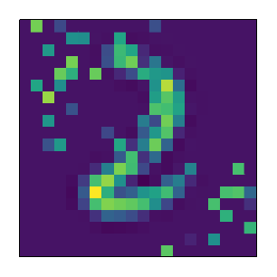 Ruído Q2 e Q4 | 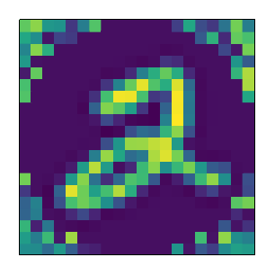 Ruído Circular |
| 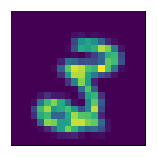 Rotação -10º | 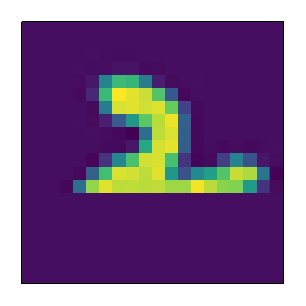 Corte 7 bits (baixo) | 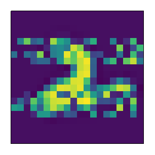 Linhas Horiz. (45%) | 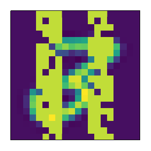 Linhas Vert. (90%) |

---

## 🏆 Conclusões Principais

A solução final resolve o problema de classificação com distinção, respeitando o princípio de usar a complexidade apenas quando estritamente necessária.

### Desempenho no Mooshak
Com a configuração otimizada, o grupo atingiu uma classificação de **92.25%** na plataforma Mooshak (modelo `src/models/92_250`).

**Estratégia Vencedora:**
A estratégia que garantiu o melhor desempenho consistiu em **cortar os primeiros 7 bits** (de cima para baixo) de cada imagem. Esta técnica permitiu que a rede se focasse exclusivamente nas partes distintivas dos dígitos, ignorando a zona superior das imagens que continha pouca informação relevante.

---

## 📚 Referências Bibliográficas

1. [MNIST Database](https://wiki.pathmind.com/mnist)
2. Enunciado do Projeto: IA 2025-26 Lab 4.
3. [Milvus.io - Adam and RMSprop](https://milvus.io/ai-quick-reference/how-do-optimizers-like-adam-and-rmsprop-work)
4. [AIShort - Choosing the Right Optimizer](https://aishort.co.uk/choosing-the-right-optimizer-for-neural-networks-a-practical-guide/)
5. [GeeksforGeeks - Adam Optimizer](https://www.geeksforgeeks.org/deep-learning/adam-optimizer/)
6. [Innovatiana - Activation Functions](https://www.innovatiana.com/es/post/activation-function-in-ai)
7. [DataCamp - Normalization](https://www.datacamp.com/pt/tutorial/normalization-in-machine-learning)
8. [GitHub - Curvature-Orientation-MLP](https://github.com/Meetra21/Curvature-Orientation-MLP)
9. [Jones (2021) - Publication](https://www.ilenna.com/publication/jones-2021/Jones-2021.pdf)
10. [arXiv:1905.12135](https://arxiv.org/pdf/1905.12135)
11. [Reddit - Tanh vs Sigmoid](https://www.reddit.com/r/MachineLearning/comments/3x9kld/tanh_or_sigmoid_for_simple_nn_in_mnist/)
12. [Google Developers - Numerical Data Normalization](https://developers.google.com/machine-learning/crash-course/numerical-data/normalization?hl=pt-br)
13. [Exxact Corp - Maximizing AI Efficiency](https://www.exxactcorp.com/blog/deep-learning-ai/maximizing-ai-efficiency-tuning-and-regulation)
14. [Machine Learning Mastery - Data Scaling](https://machinelearningmastery.com/how-to-improve-neural-network-stability-and-modeling-performance-with-data-scaling/)
15. [Scikit-Learn - Neural Networks](https://scikit-learn.org/stable/modules/neural_networks_supervised.html)
16. [arXiv:2506.17826](https://arxiv.org/html/2506.17826v1)
17. [Ameer Saleem - Stochastic Gradient Descent](https://ameersaleem.substack.com/p/stochastic-gradient-descent-and-mini)
18. [LunarTech - Gradient Descent Comparison](https://www.lunartech.ai/blog/gradient-descent-vs-mini-batch-gradient-descent-vs-stochastic-gradient-descent-an-expert-comparison)